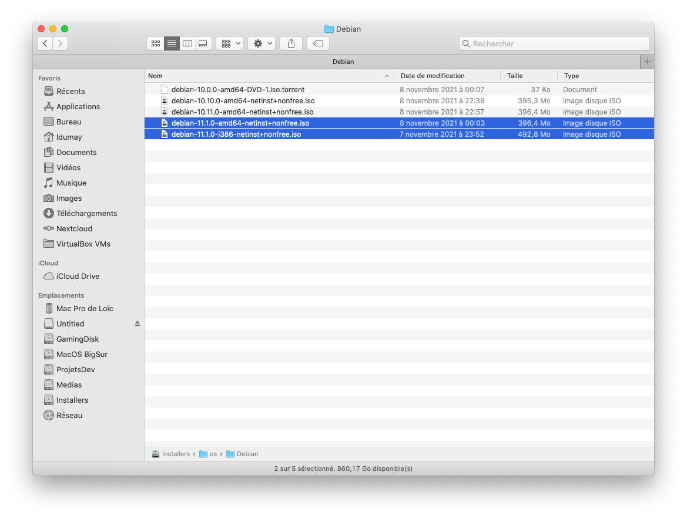
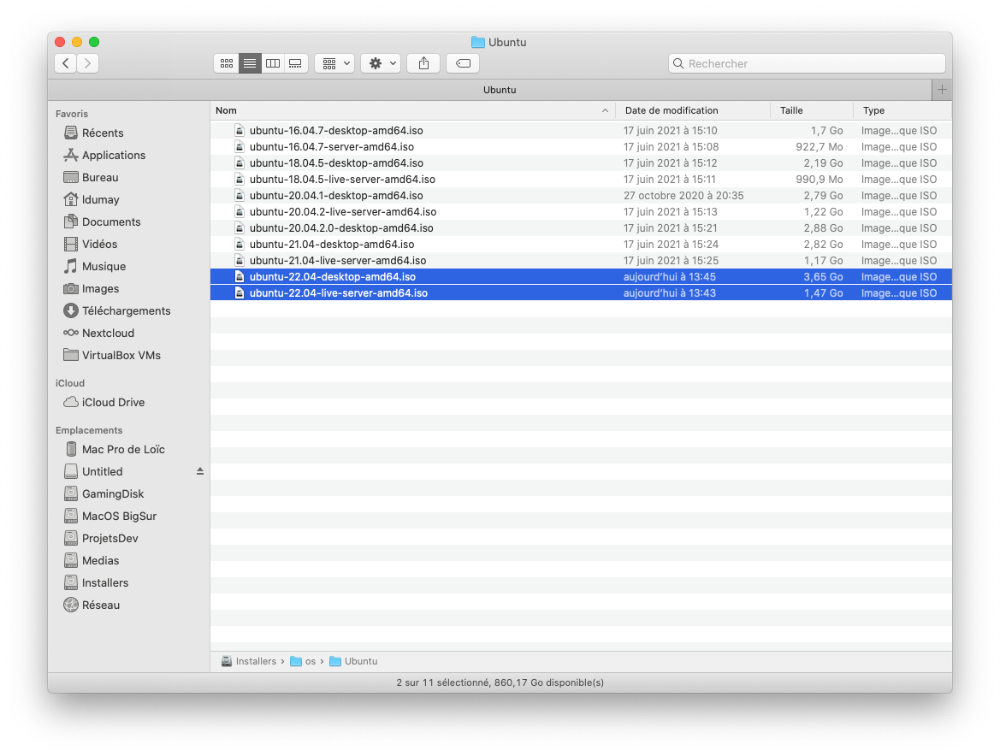

# Guide - Linux

## 1 - Disks d'installations utilisés

### 1.1 - Disques utilisés pour **Debian 11**.

[Téléchargable ici](https://cdimage.debian.org/debian-cd/current/amd64/)

### 1.2 - Disques utilisés pour **Ubuntu 22.04**.

[Téléchargable ici](https://mirrors.ircam.fr/pub/ubuntu/releases/22.04/)

## 2 - VirtualBox

## 3 - Installations (et VMs)

- VirtualBox --> [Guide](Guide_001_virtualbox.md)
- Debian 11 --> [Guide d'installation de Debian 11](Guide_002_installation_debian_11.md)
- Ubuntu Desktop 22.04 --> [Guide d'installation d'Ubuntu Desktop 22.04](Guide_003_installation_ubuntu-desktop_22-04.md)
- Ubuntu Server 22.04 --> [Guide d'installation d'Ubuntu Server 22.04](Guide_004_installation_ubuntu-server_22-04.md)
- Essentiels Linux --> [Guide](Guide_005_essentiels_linux.md)

## 4 - Essentiels Linux

| Guide comprenant |
|---|
| Debian 11 |
| Ubuntu Desktop 22.04 |
| Ubuntu Server 22.04 |
| [Disponible ici](Guide_005_essentiels_linux.md) |